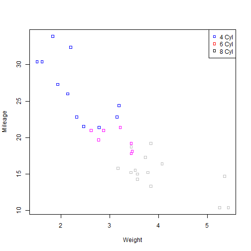

Vehicle Evaluation Guide
========================================================
author: Lokesh KD
date: Tue Mar 01 17:17:30 2016
autosize: true
transition: rotate

Data Science Specialization   
Johns Hopkins University   
Course Project Application

Factors to Consider in a Vehicle
========================================================

Following are some factors that must be evaluated before a vehicle purchase.

- Mileage
- Horse Power
- Automatic/Manual
- Number of Cylinders
- Weight   

How this Application Helps?
========================================================
Simple! By Comparing.

Visualizations would look like....

The Application
========================================================
This application lets **You** compare various factors and help in decision making.   

Application can be accessed [Here](http://shinyapps.io)   
Source Code can be obtained [Here](http://github.com/LokeshKD/DDP)   
This presentaion is [Here](http://lokeshkd.github.io/DDP/DDP_Pres/Vehicle_guide.html)    

Acknowledgements
========================================================
Data Science Course by Johns Hopkins University   
Learnt [Here](https://www.coursera.org/specializations/jhu-data-science)

Authors
  - Leff Leak   
  - Roger Peng   
  - Brian Caffo   

